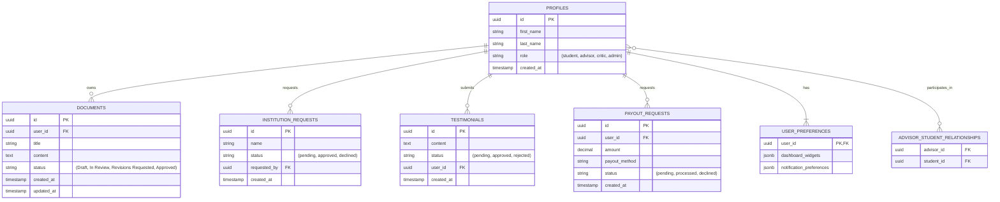

# Data Model

**Date**: 2025-10-18
**Spec**: [spec.md](./spec.md)

This document provides a detailed breakdown of the database schema based on the feature specification. The schema will be implemented in Supabase (PostgreSQL).

## ERD (Entity-Relationship Diagram) - Mermaid

## Table Definitions

### `profiles`

Stores public user data and role information.

| Column | Type | Constraints | Description |
| :--- | :--- | :--- | :--- |
| `id` | `uuid` | Primary Key, Foreign Key to `auth.users.id` | The unique identifier for the user. |
| `first_name` | `text` | | The user's first name. |
| `last_name` | `text` | | The user's last name. |
| `role` | `text` | Not Null, Check in (`student`, `advisor`, `critic`, `admin`) | The user's role within the application. |
| `created_at` | `timestamptz` | Not Null, Default `now()` | Timestamp of when the profile was created. |

### `documents`

Stores the academic documents created by students.

| Column | Type | Constraints | Description |
| :--- | :--- | :--- | :--- |
| `id` | `uuid` | Primary Key, Default `gen_random_uuid()` | The unique identifier for the document. |
| `user_id` | `uuid` | Not Null, Foreign Key to `profiles.id` | The ID of the student who owns the document. |
| `title` | `text` | Not Null | The title of the document. |
| `content` | `jsonb` | | The full document content, likely in a format like JSON (from Tiptap). |
| `status` | `text` | Not Null, Default `'Draft'` | The current state of the document in the review lifecycle. |
| `created_at` | `timestamptz` | Not Null, Default `now()` | Timestamp of when the document was created. |
| `updated_at` | `timestamptz` | Not Null, Default `now()` | Timestamp of the last modification. |

### `advisor_student_relationships`

A linking table to manage the many-to-many relationship between advisors and students.

| Column | Type | Constraints | Description |
| :--- | :--- | :--- | :--- |
| `advisor_id` | `uuid` | Primary Key, Foreign Key to `profiles.id` | The ID of the advisor. |
| `student_id` | `uuid` | Primary Key, Foreign Key to `profiles.id` | The ID of the student. |

### `payout_requests`

Stores requests from critics/advisors to cash out their earnings.

| Column | Type | Constraints | Description |
| :--- | :--- | :--- | :--- |
| `id` | `uuid` | Primary Key, Default `gen_random_uuid()` | The unique identifier for the payout request. |
| `user_id` | `uuid` | Not Null, Foreign Key to `profiles.id` | The ID of the user requesting the payout. |
| `amount` | `decimal` | Not Null, Check `> 0` | The amount of money requested. |
| `payout_method`| `text` | Not Null | The method for the payout (e.g., 'PayPal', 'Bank Transfer'). |
| `status` | `text` | Not Null, Default `'pending'` | The current status of the request. |
| `created_at` | `timestamptz` | Not Null, Default `now()` | Timestamp of when the request was made. |

*(Other tables like `institution_requests`, `testimonials`, and `user_preferences` will be implemented as detailed in the specification but are secondary to the core document workflow.)*
